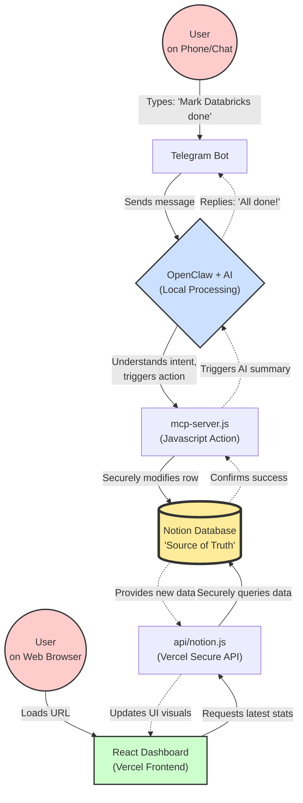

# System Architecture: Learning Command Center

This document visualizes how data flows through the Learning Command Center ecosystem. The system is built on a Headless Architecture. 

The left side represents the **Automation Flow** (writing to the database via Telegram). 
The right side represents the **Visual Dashboard Flow** (reading from the database via Vercel). 
At the very center is **Notion**, anchoring everything securely as the central database and single source of truth.

## Diagram

## The Key Takeaway

The two interfaces (Telegram and your React Dashboard) **never actually communicate directly with each other**. 

Instead, they act independently:
1. OpenClaw acts as an intelligent writer, utilizing the MCP server to directly modify Notion rows using your Notion Token.
2. The deployed Vercel application acts as a clean reader, pulling the latest Notion data whenever you open the dashboard page.

Because Notion acts globally and updates instantly, saving a task in Telegram guarantees your web browser dashboard will reflect the accurate stats on its next load. No sync conflicts, no manual entry—just a clean, decoupled data pipeline.
